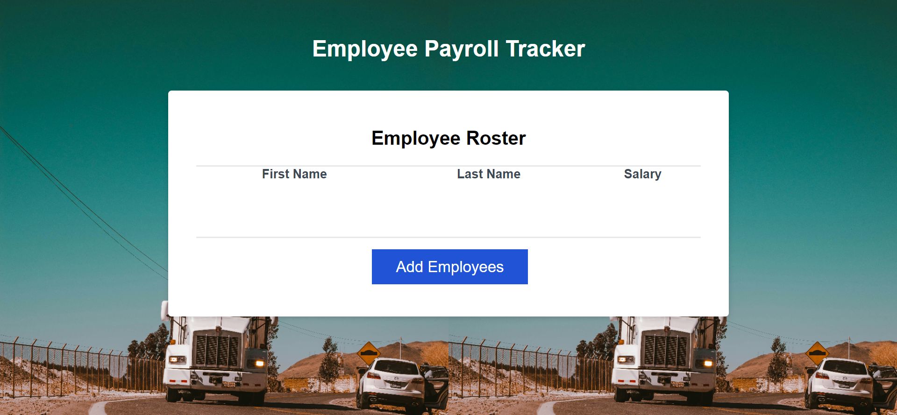

# Garcias Trucking Company L.L.C.

## Employee Salary Tracker

The motivation for this project was to practice javascript, creating objects to containg data/properties like name, salary amount. Also practiced loops and conditional statements. Also practiced the random function to display an employee and index random. 
This solved the problem of calculating the average salary of all employees by coding an algorithm to add all employees salary and divide by number of employees or length. Display in console. Also learned promts to have user enter data and confirm which has user decide if they would like to continue.

I learned how implementing the use of the following functions:

 confirm, prompt, random.
 Also while loop and if statements.

## Table of Contents

1). Garcias Trucking Company L.L.C. webpage.

## Usage

github pages url: https://robscafe433.github.io/Garcias-Trucking-Company-L.L.C./

Github repository: https://github.com/robscafe433/Garcias-Trucking-Company-L.L.C.

Webpage Screenshot:

   

## Badges

